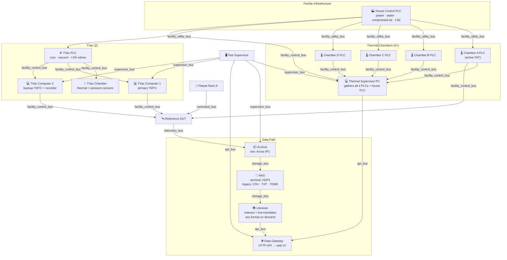

# Architecture

Gossamer is intentionally small, but it models the same control points that matter in a real environmental-test software stack: contracts, provenance, authority, requirements, evidence, and an operator-facing view.

## Design Principles

- Backend-owned semantics: the API decides source quality, graph roles, requirement status, command authority, and report shape.
- Deterministic fixtures: synthetic inputs can be regenerated and reviewed in version control.
- Public-safe abstraction: every name, value, limit, anomaly, and bus is fictional or generic.
- Offline-first demo: the full system runs on one machine without hardware, private services, or external credentials.
- Interview-friendly depth: the UI is simple, but the repository has enough structure to discuss extension paths.

## Physical to Digital Topology

Gossamer simulates a complex facility environment where physical hardware signals are abstracted into digital data streams.

### Data Flows

- **Live path:** DUT → Arrow IPC (archive) → librarian live-translates → gateway → web UI.
- **Archival path:** Archive exports Arrow → HDF5 on NAS when test finishes (supervisor/librarian triggers).
- **Legacy data:** CSV/TXT/TDMS on NAS; librarian indexes and serves with on-the-fly translation — any gateway can subscribe.
- **Thermal path:** Chamber PLCs → thermal supervisor PC → gateway (separate from DUT telemetry path).
- **TVac path:** TVac PLC status → TVac computers → DUT TMTC + supervisor → gateway.
- **Command Authority:** The gateway utilizes a Lease Manager, ensuring only the authenticated supervisor holding the lease can send control commands down the API bus to the respective chambers or Flatsat racks.

## Flow

1. `cmd/gossamer-fixtures` creates synthetic campaign, source, topology, supervisor, bus tap, graph, and telemetry fixtures under `fixtures/public`.
2. `cmd/gossamer-report` evaluates campaign requirements against fixture telemetry and writes evidence reports.
3. `cmd/gossamer-server` serves read-only fixture contracts and mocked command-authority endpoints.
4. `web` consumes those API contracts and renders the landing page plus operator views.

## Contracts

Every top-level API payload carries:

- `schema_version`: currently `1`,
- `generated_at`: deterministic timestamp for public fixtures,
- typed content owned by `internal/contracts`.

This keeps the frontend from deriving critical meaning from labels. The browser receives already-classified source states, graph series roles, supervisor lane states, bus stream health, requirement results, and command-authority state.

## Extension Points

- Add a new synthetic facility by extending the topology and source generator.
- Add a new campaign by generating telemetry, requirements, graph models, and reports for a new campaign ID.
- Add a new requirement evaluator by implementing a deterministic rule in `internal/evaluator`.
- Add real integrations only in a private downstream fork with separate fixtures and a renewed clean-room review.
